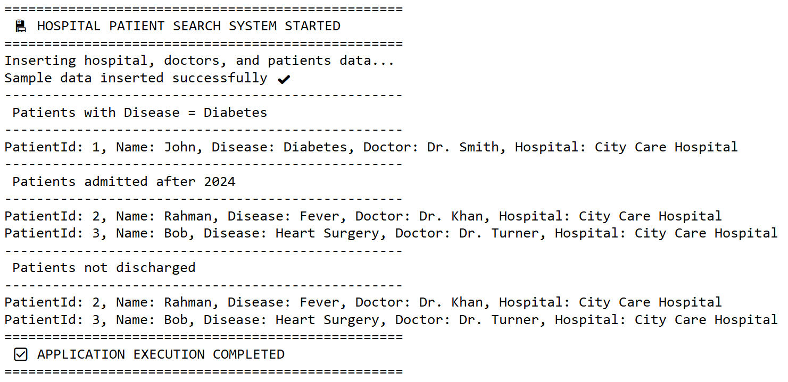
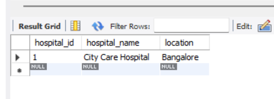
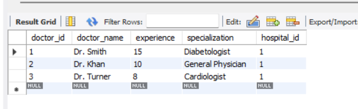
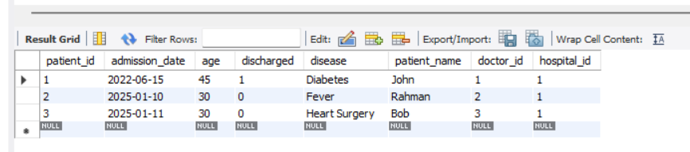

## 🏥 Hospital Patient Search System

A Spring Boot application that manages hospitals, doctors, and patients using **Spring Data JPA** and **MySQL**.  
The system allows searching patients based on disease, admission date, and discharge status.

---

## 📌 Project Overview

This project demonstrates a real-world **Hospital Management & Patient Search System** implemented using modern Spring Boot practices.  
It focuses on **entity relationships**, **JPA finder methods**, **logging with SLF4J**, and **clean architecture**.

---

## 🚀 Features

- Manage **Hospitals, Doctors, and Patients**

- One-to-Many & Many-to-One JPA relationships

- Search patients by:

  - Disease

  - Admission date

  - Discharge status

- Prevent duplicate hospital insertion

- Uses **CommandLineRunner** for demo execution

- Structured logging using **SLF4J**

- Custom exception handling

- MySQL database integration

---

## 🛠️ Tech Stack

- **Java 20**

- **Spring Boot 4.x**

- **Spring Data JPA**

- **Hibernate**

- **MySQL 8**

- **Lombok**

- **SLF4J / Logback**

- **Maven**

---

## 🗂️ Project Structure

Boot-DataJPA-HospitalMgmt

│

├── src

│   ├── main

│   │   ├── java

│   │   │   └── com

│   │   │       └── hs

│   │   │           │

│   │   │           ├── entity

│   │   │           │   ├── Hospital.java

│   │   │           │   ├── Doctor.java

│   │   │           │   └── Patient.java

│   │   │           │

│   │   │           ├── repository

│   │   │           │   ├── HospitalRepository.java

│   │   │           │   ├── DoctorRepository.java

│   │   │           │   └── PatientRepository.java

│   │   │           │

│   │   │           ├── service

│   │   │           │   ├── Patientservice.java

│   │   │           │   └── PatientServiceImpl.java

│   │   │           │

│   │   │           ├── runner

│   │   │           │   └── PatientRunner.java

│   │   │           │

│   │   │           ├── exception

│   │   │           │   └── ResourceNotFoundException.java

│   │   │           │

│   │   │           └── HospitalSearchApplication.java

│   │   │

│   │   └── resources

│   │       ├── application.properties

│   │       └── banner.txt (optional)

│   │

│   └── test

│       └── java

│           └── com

│               └── hs

│                   └── HospitalSearchApplicationTests.java

│

├── pom.xml

├── README.md

├── .gitignore

└── mvnw / mvnw.cmd

---

## 🧩 Entity Relationships

- **Hospital → Doctors** (One-To-Many)

- **Hospital → Patients** (One-To-Many)

- **Doctor → Patients** (One-To-Many)

- **Patient → Hospital** (Many-To-One)

- **Patient → Doctor** (Many-To-One)

---

## ⚙️ Database Configuration

Create a MySQL database:

CREATE DATABASE hospitaldb;

---

## applicaton.properties File

spring.application.name=Boot-DataJPA-HospitalMgmt
server.port=8083

spring.datasource.url=jdbc:mysql://localhost:3306/hospitaldb
spring.datasource.username=root
spring.datasource.password=your_password

spring.jpa.hibernate.ddl-auto=update
spring.jpa.show-sql=true

---

## 📊 Sample Console Output

## Data Insertion:

## Data Already Exist:

## Hospital DB:

## Doctor DB:

## Patient DB:

---

## 📚 Key Concepts Demonstrated

Spring Boot auto-configuration

JPA entity mapping & relationships

Finder methods using JpaRepository

CommandLineRunner usage

Logging with @Slf4j

Exception handling

Clean layered architecture

---

## 🔮 Future Enhancements

REST APIs using @RestController

Swagger/OpenAPI documentation

Pagination & sorting

DTO pattern with ModelMapper

Spring Security & JWT

Dockerization

Frontend integration (React / Angular)
